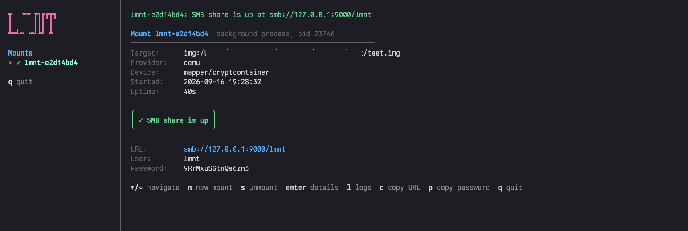

# lmnt

**lmnt** opens Linux disks on macOS: ext4, xfs, btrfs, f2fs, LVM volumes,
LUKS-encrypted partitions, and anything else a Linux kernel can mount.

It does not reimplement any file system. Instead it boots a tiny Alpine Linux
guest, hands it the disk, mounts the disk there with the real Linux drivers,
and shares the mount back to the host over SMB, FTP or SFTP. Finder or any
file manager then sees an ordinary network drive.



## Features

| Feature               | What you get                                                                                                                  |
|-----------------------|-------------------------------------------------------------------------------------------------------------------------------|
| Linux file systems    | ext2/3/4, xfs, btrfs (subvolumes via `-o subvol=`), f2fs, vfat, exfat, ntfs3: whatever the guest kernel mounts                |
| LVM                   | volume groups are activated automatically, logical volumes appear as `mapper/<vg>-<lv>`                                       |
| LUKS                  | LUKS1/2 volumes (`-l`) and LUKS containers holding LVM (`--luks-container`, `-c`), the usual full-disk-encryption layouts     |
| Sources               | physical disks (`dev:`), USB devices (`usb:`, experimental) and raw image files (`img:`)                                      |
| Read-only mode        | `-r`: the disk is attached read-only, mounted with `-o ro` and shared read-only, so nothing on it can change                  |
| Shares                | SMB for Finder, SFTP for any SSH client, FTP as a fallback, user `lmnt` with a one-off or chosen password                     |
| Background mounts     | `--detach` hands the mount to a process of its own, `lmnt mounts` and `lmnt stop` manage every mount on the machine           |
| Terminal UI           | `lmnt tui`: a guided new-mount flow with a live device list, plus a dashboard of all running mounts                           |
| New images            | `lmnt create` makes a blank raw image, optionally inside a LUKS2 container, with the file system of your choice               |
| Two ways to run Linux | a QEMU virtual machine (all sources) or a privileged Docker container (images only, starts in a second)                       |
| Safety                | refuses disks the host has mounted, kills the guest if macOS mounts one behind its back, unmounts and flushes before it stops |
| Guest shell           | `lmnt shell` opens a root shell in the guest, with extra port forwards and optional internet access                           |

```
$ sudo lmnt run dev:/dev/disk4 vdb1

SMB share is up. Press Ctrl+C to unmount and stop.

  URL:      smb://127.0.0.1:9000/lmnt
  User:     lmnt
  Password: 3fKq81zLpXw2Rm7N
```

## How it runs Linux

|                         | `--provider qemu` (default)                           | `--provider docker`                                      |
|-------------------------|-------------------------------------------------------|----------------------------------------------------------|
| Runs                    | Alpine VM under QEMU with the Hypervisor framework    | Privileged container on Docker Desktop or OrbStack       |
| Physical disks `dev:`   | yes, needs root                                       | no: the container runtime's VM cannot see host disks     |
| USB devices `usb:`      | experimental                                          | no                                                       |
| Disk image files `img:` | yes, no root needed                                   | yes, no root needed                                      |
| Start-up                | about 15–20 s                                         | about 1 s                                                |
| One-time setup          | `lmnt build` (downloads the Alpine installer, ~1 min) | `lmnt build --provider docker` or automatic on first use |
| Disk name in the guest  | `vdb`, `vdb1`, …                                      | `loop0`, `loop0p1`, …                                    |

Both providers share every other part: mounting, LVM, LUKS and the file shares behave identically.

## Install

- **QEMU**: `brew install qemu`, then `go install github.com/yousysadmin/lmnt/cmd/lmnt@latest`
  (or a release binary once published).
- **Docker instead of QEMU**: any Docker-compatible runtime, nothing else.

Details are in [docs/INSTALL.md](docs/INSTALL.md).

## Quick start

```sh
lmnt build                          # once, builds the Alpine guest image
lmnt ls  img:backup.img             # what is on the disk?
lmnt run img:backup.img vdb1        # share partition 1 over SMB

sudo lmnt ls  dev:/dev/disk4        # a real disk
sudo lmnt run dev:/dev/disk4 vdb2

lmnt run --provider docker img:backup.img loop0p1 --share sftp
lmnt run -r img:evidence.img vdb1  # read-only: the image is never written to
```

Connect with the printed URL, user `lmnt` and the one-off password (`--ask-share-password` or `--share-password` sets
your own instead). Press
Ctrl+C when done: lmnt unmounts, powers the guest off and removes everything
it created. Step-by-step walkthroughs: [docs/USAGE.md](docs/USAGE.md).

## Targets

The first argument of `ls`, `run` and `shell` says what the guest gets:

| Target                   | Meaning                                                                      | Root | Providers    |
|--------------------------|------------------------------------------------------------------------------|------|--------------|
| `img:<path>`             | raw disk image file (dd dump, `.img`), attached as a whole disk              | no   | qemu, docker |
| `dev:<path>`             | physical disk, e.g. `/dev/disk4` (the whole disk), with its real sector size | yes  | qemu         |
| `usb:<vendor>,<product>` | USB device by hex IDs, e.g. `usb:0781,5583`                                  | yes  | qemu         |

A disk must never be mounted on the host and in the guest at the same time.
lmnt refuses to start when the disk looks mounted, and kills the guest the
moment that changes while it runs. Use `--sector-size 512` for disks that
were written by tools assuming 512-byte sectors regardless of the hardware.

## Commands

```
lmnt build   [--force]                     prepare the guest image
lmnt create  <path> --size N               make a new image, optionally encrypted
lmnt ls      <target>                      lsblk view of the disk
lmnt run     <target> [device] [fstype]    mount and share
lmnt mounts                                what is running right now
lmnt stop    <id...> | --all               unmount a background mount
lmnt shell   [target]                      root shell in the guest
lmnt clean   [--yes]                       delete ~/.lmnt
lmnt tui                                   interactive terminal UI
lmnt version
```

Useful flags:

| Flag                         | Applies to | What                                                                                                  |
|------------------------------|------------|-------------------------------------------------------------------------------------------------------|
| `-s, --size N`               | create     | image size, e.g. `10G` (powers of 1024)                                                               |
| `-e, --encrypt`              | create     | wrap the new image in a LUKS2 container                                                               |
| `--fs TYPE`, `--label NAME`  | create     | file system to create (default ext4) and its label                                                    |
| `-f, --force`                | create     | overwrite an existing file                                                                            |
| `--share smb\|ftp\|sftp`     | run        | file share protocol (default smb)                                                                     |
| `-l, --luks`                 | run        | the device is a LUKS volume, passphrase is prompted                                                   |
| `--luks-container DEV`, `-c` | ls, run    | open a LUKS container first so the LVM inside becomes visible (`-c`: the whole disk is the container) |
| `-r, --read-only`            | run        | attach, mount and share read-only: the disk cannot be changed                                         |
| `-o, --mount-options`        | run        | `mount -o` options, e.g. `noatime,subvol=@home`                                                       |
| `--listen IP`                | run        | bind the share to another address than 127.0.0.1                                                      |
| `--ftp-public-ip IP`         | run        | address advertised to FTP clients for passive mode                                                    |
| `--shell`                    | run        | open a guest shell while the share is up                                                              |
| `-D, --detach`               | run        | keep the mount running in the background and give the terminal back                                   |
| `--forward SPEC,…`           | shell      | extra TCP forwards `hostport:guestport` or `ip:hostport:guestport`                                    |
| `-p, --provider`             | all        | `qemu` or `docker`                                                                                    |
| `-m, --memory MiB`           | all        | guest memory, raised to 2048 automatically when LUKS is used                                          |
| `--open-network`             | all        | give the guest internet access (needed for `apk add` in a shell)                                      |
| `--debug`                    | all        | show the QEMU window / provider diagnostics                                                           |

## Background mounts

A mount normally owns its terminal: it stays in the foreground and Ctrl+C ends
it. `--detach` moves it into a process of its own instead, so the terminal
comes back as soon as the share is up:

```sh
lmnt run --detach img:backup.img vdb1
lmnt mounts                  # ID, target, device, share, uptime
lmnt stop lmnt-93a2e47a      # unmounts and powers the guest off
lmnt stop --all
```

A passphrase for a LUKS mount is asked for before the mount moves to the
background, and handed over out of band, the background process never needs a
terminal. Its output goes to `~/.lmnt/sessions/<id>.log`.

`lmnt stop` asks, it does not kill: the mount unmounts the file system and
powers its guest off before the command returns, so nothing is left
half-written. Mounts started by the TUI are the same kind of process, so all
three commands work on them too.

## Terminal UI

`lmnt tui` is the same tool as a full-screen interface. It lists every lmnt
mount on the machine, including those started with `lmnt run` in other
terminals, with URL, user and password, and can stop them. `n` starts a new
mount as a guided flow: choose the target, whether the disk may be written to,
the provider and the protocol, a guest boots to show what is on the disk, you pick the device from its device list (LVM
volumes and LUKS containers included),
type a passphrase if asked, and
the mount moves into a process of its own.

Because every mount is its own process, quitting is a question rather than an
ending: the TUI asks whether to leave the mounts it started running or to
unmount them first. Left running, they are still there for `lmnt mounts`, for
`lmnt stop`, and for the next `lmnt tui`.

| Key      | Action                                                |
|----------|-------------------------------------------------------|
| `n`      | new mount                                             |
| `s`      | unmount the selected mount                            |
| `enter`  | details: URL, user, password, notes, recent log lines |
| `l`      | the mount's log                                       |
| `c`, `p` | copy URL or password to the clipboard                 |
| `q`      | quit: leave the mounts running, or unmount them first |

## Shares

| Protocol | Client                                | Notes                                                                        |
|----------|---------------------------------------|------------------------------------------------------------------------------|
| **smb**  | Finder ⌘K `smb://127.0.0.1:9000/lmnt` | writes as root, so every file on the disk is writable                        |
| **ftp**  | Finder (read-only), Cyberduck, `curl` | passive mode, user `lmnt` has uid 1000, so files owned by root are read-only |
| **sftp** | Cyberduck, Mountain Duck, `sftp`      | password login, writes as root, works through a plain TCP port anywhere      |

## Read-only mode

`lmnt run -r` (the "Access" step in the TUI) keeps the disk exactly as it is.
The guarantee is layered: the provider attaches the disk read-only (QEMU
`readonly=on`, `losetup --read-only` in the container), so the guest kernel
cannot write to it even by accident, LUKS mappings are opened with
`cryptsetup --readonly`, the file system is mounted with `-o ro`, and the
share itself refuses writes (`read only = yes`, `write_enable=NO`,
`internal-sftp -R`), so Finder shows a read-only volume instead of failing
half-way through a copy. `lmnt mounts` shows `ro` in its ACCESS column.

A file system that was not unmounted cleanly may refuse a read-only mount
because it wants to replay its journal first. Add `-o noload` for ext4 or
`-o norecovery` for xfs and btrfs to mount it as it is.

## LUKS and LVM

- `lmnt create vault.img --size 10G --encrypt` makes a new encrypted image:
  a sparse raw file holding a LUKS2 container with ext4 inside. Open it with
  `lmnt run -l img:vault.img`.
- `lmnt run -l img:disk.img vdb2` opens `vdb2` with cryptsetup and mounts the
  plaintext volume.
- LVM volume groups are activated automatically, logical volumes are
  addressed as `mapper/<vg>-<lv>` (see `lmnt ls`).
- A LUKS container holding LVM (the typical Ubuntu/Fedora full-disk
  encryption layout): `lmnt ls img:disk.img --luks-container vdb3`, then
  `lmnt run img:disk.img --luks-container vdb3 mapper/vgubuntu-root`.
- LUKS2 key derivation needs memory. lmnt gives the guest 2 GiB whenever LUKS
  is involved, `--memory 4096` goes higher if `cryptsetup` still complains.
